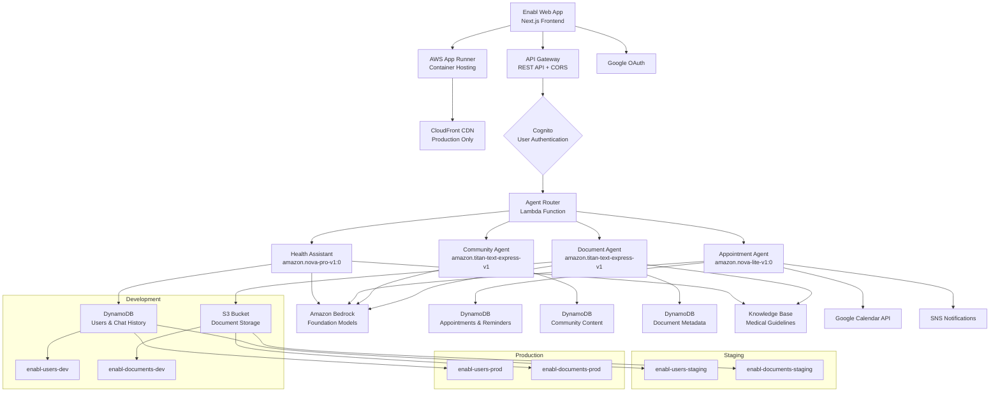

# Enabl Health Backend Infrastructure

AWS CDK infrastructure for Enabl Health - Your AI-powered everyday health assistant with HIPAA-compliant, multi-agent AI systems.

## 🏗️ Architecture Overview

This CDK project creates and manages all backend AWS resources for Enabl Health with a **three-tier deployment strategy** supporting Development, Staging, and Production environments.

### Current Deployment Status

**✅ Development Environment**
- Backend: `enabl-backend-development` (operational)
- API Gateway: `https://9zbq4e5m86.execute-api.us-east-1.amazonaws.com/dev/`
- Frontend: Ready for App Runner deployment → `dev.enabl.health`

**✅ Staging Environment**
- Backend: `enabl-backend-staging` (operational)
- API Gateway: `https://y1rp7krhca.execute-api.us-east-1.amazonaws.com/staging/`
- Frontend: Ready for App Runner deployment → `staging.enabl.health`

**🔄 Production Environment**
- Backend: Resource cleanup required before deployment
- API Gateway: Pending production backend deployment
- Frontend: App Runner + CloudFront setup → `enabl.health`

### System Architecture Diagram


    ECR -.-> BA4
    
    %% Monitoring
    CW[CloudWatch<br/>Logs & Metrics] --> BA1
    CW --> BA2
    CW --> BA3
    CW --> BA4
    
    subgraph "Agent Capabilities"
        AC1[Health Guidance<br/>Symptom Analysis<br/>Wellness Advice]
        AC2[Medication Reminders<br/>Appointment Scheduling<br/>Calendar Integration]
        AC3[Health Research<br/>Community Insights<br/>Evidence-Based Info]
        AC4[Document Analysis<br/>Lab Results<br/>Medical Records]
    end
    
    BA1 -.-> AC1
    BA2 -.-> AC2
    BA3 -.-> AC3
    BA4 -.-> AC4
```

### Core Services
- **Amazon Cognito**: User authentication with social sign-in (Google, Apple, Microsoft)
- **Amazon DynamoDB**: NoSQL database for user data, chats, documents, and appointments
- **Amazon S3**: Object storage for documents and user uploads with HIPAA compliance
- **API Gateway**: REST API endpoints with Cognito authentication and rate limiting
- **AWS Lambda**: Serverless business logic functions with Bedrock agent integration
- **CloudFront**: Content delivery network for global performance
- **Route53**: DNS management for custom domains

### Amazon Bedrock AI Agents

**Multi-Agent Architecture**: Four specialized AI agents with intelligent routing and context sharing.

#### 1. Health Assistant Agent
- **Model**: `amazon.nova-pro-v1:0` (advanced reasoning)
- **Purpose**: Primary health consultations and guidance
- **Capabilities**: Natural language processing, intent recognition, medical knowledge
- **Access**: Guest and authenticated users

#### 2. Community Agent  
- **Model**: `amazon.titan-text-express-v1` (content curation)
- **Purpose**: Health content discovery and community insights
- **Capabilities**: Content validation, personalized recommendations, trending analysis
- **Access**: Guest and authenticated users (personalization for logged-in)

#### 3. Appointment Agent
- **Model**: `amazon.nova-lite-v1:0` (scheduling intelligence)
- **Purpose**: Smart appointment booking and calendar management
- **Capabilities**: Multi-calendar integration, conflict resolution, intelligent notifications
- **Access**: Authenticated users only

#### 4. Document Agent
- **Model**: `amazon.titan-text-express-v1` (document processing)
- **Purpose**: Secure document management and analysis
- **Capabilities**: AI-powered categorization, content extraction, semantic search
- **Access**: Authenticated users only

### Foundation Model Strategy

**Current Implementation**: Amazon-only models for simplified integration and cost management.

**Environment-Specific Models**:
```yaml
Development (Cost-Optimized):
  Health Assistant: amazon.titan-text-express-v1
  Community Agent: amazon.titan-text-lite-v1  
  Appointment Agent: amazon.nova-micro-v1:0
  Document Agent: amazon.titan-text-express-v1

Staging & Production:
  Health Assistant: amazon.nova-pro-v1:0
  Community Agent: amazon.titan-text-express-v1
  Appointment Agent: amazon.nova-lite-v1:0  
  Document Agent: amazon.titan-text-express-v1
```

**Future Scalability**: Architecture designed for easy integration of Anthropic Claude, Cohere, and other foundation models based on user preferences.

### Security & Compliance
- End-to-end encryption for sensitive health data
- HIPAA-compliant infrastructure configuration
- IAM roles with least-privilege access
- Environment isolation for complete data separation
- Bedrock guardrails for AI safety and compliance

## 🚀 Quick Start

### Prerequisites
- AWS CLI configured with appropriate permissions
- Node.js 18+ and npm
- AWS CDK CLI installed globally: `npm install -g aws-cdk`

### Installation

1. **Install dependencies**
   ```bash
   npm install
   ```

2. **Bootstrap CDK (first time only)**
   ```bash
   npm run bootstrap
   ```

3. **Deploy to development environment**
   ```bash
   npm run deploy:dev
   ```

### Environment-Specific Deployments

```bash
# Development environment
npm run deploy:dev

# Staging environment
npm run deploy:staging

# Production environment
npm run deploy:prod
```

## 🤖 AI Agent Architecture

Enabl Health uses a sophisticated multi-agent system powered by Amazon Bedrock AgentCore for advanced health assistance:

### Agent Types

#### 1. Health Assistant (`health-assistant`)
- **Purpose**: Primary health guidance, symptom assessment, wellness advice
- **Model**: Amazon Titan Text Express v1 with AgentCore reasoning
- **Capabilities**: 
  - Medical symptom analysis and triage
  - Health condition explanations
  - Wellness recommendations
  - Medication information lookup
  - Emergency situation detection
- **Image URI**: `775525057465.dkr.ecr.us-east-1.amazonaws.com/enabl-health-assistant:latest`

#### 2. Appointment Agent (`appointment-agent`)
- **Purpose**: Medication reminders, appointment scheduling, healthcare routine management
- **Model**: Amazon Titan Text Express v1 with AgentCore planning
- **Capabilities**:
  - Medication reminder setup and management
  - Calendar integration (Google, Apple, Outlook)
  - Appointment scheduling and notifications
  - Prescription refill alerts
  - Healthcare routine optimization
- **Image URI**: `775525057465.dkr.ecr.us-east-1.amazonaws.com/enabl-appointment-agent:latest`

#### 3. Community Agent (`community-agent`)
- **Purpose**: Health research, community insights, evidence-based information
- **Model**: Amazon Titan Text Express v1 with research capabilities
- **Capabilities**:
  - Health article curation and analysis
  - Evidence-based research synthesis
  - Community health insights
  - Latest health news and studies
  - Trusted health resource recommendations
- **Image URI**: `775525057465.dkr.ecr.us-east-1.amazonaws.com/enabl-community-agent:latest`

#### 4. Document Agent (`document-agent`)
- **Purpose**: Medical document analysis and interpretation
- **Model**: Amazon Titan Text Express v1 with document processing
- **Capabilities**:
  - Medical document upload and parsing
  - Lab result interpretation
  - Medical record organization
  - Document search and retrieval
  - Health data extraction and summarization
- **Image URI**: `775525057465.dkr.ecr.us-east-1.amazonaws.com/enabl-document-agent:latest`

### AgentCore Integration

#### Advanced Reasoning Features
- **Planning & Orchestration**: Multi-step task breakdown and execution
- **Reasoning Traces**: Transparent decision-making process
- **Session Attributes**: Context-aware conversations with memory
- **Action Execution**: Real-world task completion (appointments, reminders)
- **Fallback Mechanisms**: Graceful degradation to direct models

#### Agent Routing Logic
```typescript
const agentRouter = {
  'health-assistant': 'anthropic.claude-3-sonnet',     // Complex health reasoning
  'appointment-agent': 'anthropic.claude-3-haiku',    // Fast scheduling tasks  
  'community-agent': 'amazon.titan-text-express',     // Research and curation
  'document-agent': 'cohere.command-text-v14'         // Document processing
};
```

#### Container Architecture
- **Base Image**: AWS Lambda Node.js 18 runtime for ARM64
- **Deployment**: Amazon ECR with automated builds
- **Scaling**: Serverless Lambda with container support
- **Monitoring**: X-Ray tracing and CloudWatch metrics
- **Architecture**: ARM64 (required by Bedrock AgentCore)

## 📁 Project Structure

```
enabl-backend-infrastructure/
├── bin/
│   └── enabl-backend-infrastructure.ts  # CDK app entry point
├── lib/
│   ├── config.ts                        # Environment configurations
│   ├── enabl-backend-stack.ts          # Main infrastructure stack
│   ├── constructs/                      # Reusable CDK constructs
│   └── lambda/                          # Lambda function code
│       ├── health-assistant/            # Health guidance agent
│       ├── appointment-agent/           # Appointment & medication management
│       ├── community-agent/             # Health research & community
│       └── document-agent/              # Document processing & analysis
├── docker/                              # AgentCore container configurations
│   ├── health-assistant/                # Health assistant container
│   │   ├── Dockerfile                   # Container definition
│   │   ├── package.json                # Dependencies
│   │   └── index.js                     # Agent code
│   ├── appointment-agent/               # Appointment agent container
│   ├── community-agent/                 # Community agent container
│   └── document-agent/                  # Document agent container
├── build-agents.sh                      # ECR build and push script
├── DOCKER_SETUP.md                     # Container deployment guide
├── test/                                # Unit tests
├── cdk.json                            # CDK configuration
├── package.json                        # Dependencies and scripts
└── README.md                           # This file
```

## 🚀 AgentCore Deployment

### Docker Container Build & Push

1. **Build all agent containers**
   ```bash
   ./build-agents.sh
   ```

2. **Individual agent build**
   ```bash
   # Build specific agent for ARM64 (required by Bedrock AgentCore)
   cd docker/health-assistant
   docker build --platform linux/arm64 -t enabl-health-assistant:latest .
   
   # Tag for ECR
   docker tag enabl-health-assistant:latest 775525057465.dkr.ecr.us-east-1.amazonaws.com/enabl-health-assistant:latest
   
   # Push to ECR
   docker push 775525057465.dkr.ecr.us-east-1.amazonaws.com/enabl-health-assistant:latest
   ```

### Bedrock AgentCore Setup

1. **Create agents in Bedrock Console**
   - Navigate to Amazon Bedrock → Agents → Create agent
   - Use the container URIs from ECR
   - Configure with "Create and use a new service role"
   - Set foundation model to Amazon Titan Text Express v1

2. **Update environment variables**
   ```bash
   BEDROCK_HEALTH_AGENT_ID=<your-health-agent-id>
   BEDROCK_APPOINTMENT_AGENT_ID=<your-appointment-agent-id>
   BEDROCK_COMMUNITY_AGENT_ID=<your-community-agent-id>
   BEDROCK_DOCUMENT_AGENT_ID=<your-document-agent-id>
   BEDROCK_AGENT_ALIAS_ID=TSTALIASID
   ```

## ⚙️ Configuration

Environment-specific configurations are defined in `lib/config.ts`:

### Development Environment
- **Domain**: `dev.enabl.health`
- **Database**: Pay-per-request DynamoDB tables
- **Storage**: S3 buckets with CORS for local development
- **Auth**: Google OAuth (dev client ID)

### Staging Environment
- **Domain**: `staging.enabl.health`
- **Database**: Production-like DynamoDB setup
- **Storage**: Restricted CORS origins
- **Auth**: Google OAuth (dev client ID)

### Production Environment
- **Domain**: `enabl.health`
- **Database**: High-availability DynamoDB tables
- **Storage**: Production S3 buckets with backups
- **Auth**: Google OAuth (prod client ID)

## 🔐 Authentication Setup

### Cognito Configuration
- **User Pool**: Email and phone number sign-in
- **Social Providers**: Google OAuth integration
- **Custom Attributes**: `isGuest`, `isPremium`, `preferences`
- **Password Policy**: Strong passwords with complexity requirements

### Google OAuth Setup
1. Configure OAuth consent screen in Google Cloud Console
2. Create OAuth 2.0 client ID
3. Add authorized domains and redirect URIs
4. Update client IDs in `lib/config.ts`

### Environment Variables for Frontend
After deployment, use these outputs in your Next.js app:

```bash
# Development
NEXT_PUBLIC_AWS_REGION=us-east-1
NEXT_PUBLIC_USER_POOL_ID=<UserPoolId>
NEXT_PUBLIC_USER_POOL_CLIENT_ID=<UserPoolClientId>
NEXT_PUBLIC_IDENTITY_POOL_ID=<IdentityPoolId>
NEXT_PUBLIC_API_URL=<ApiUrl>

# AgentCore Configuration
BEDROCK_REGION=us-east-1
BEDROCK_HEALTH_AGENT_ID=<HealthAgentId>
BEDROCK_APPOINTMENT_AGENT_ID=<AppointmentAgentId>
BEDROCK_COMMUNITY_AGENT_ID=<CommunityAgentId>
BEDROCK_DOCUMENT_AGENT_ID=<DocumentAgentId>
BEDROCK_AGENT_ALIAS_ID=TSTALIASID
MODEL_ID=amazon.titan-text-express-v1
```

## 📊 Database Schema

### Users Table
```json
{
  "userId": "string (PK)",
  "email": "string",
  "name": "string",
  "isGuest": "boolean",
  "isPremium": "boolean",
  "preferences": "object",
  "agentPreferences": {
    "defaultAgent": "string",
    "preferredModel": "string",
    "sessionSettings": "object"
  },
  "createdAt": "timestamp",
  "updatedAt": "timestamp"
}
```

### Chats Table
```json
{
  "userId": "string (PK)",
  "chatId": "string (SK)",
  "title": "string",
  "messages": "array",
  "agentType": "string",
  "modelUsed": "string",
  "sessionId": "string",
  "reasoningTrace": "array",
  "actionItems": "array",
  "createdAt": "timestamp",
  "updatedAt": "timestamp"
}
```

### Documents Table
```json
{
  "userId": "string (PK)",
  "documentId": "string (SK)",
  "fileName": "string",
  "fileType": "string",
  "fileSize": "number",
  "s3Key": "string",
  "metadata": "object",
  "analysisResults": "object",
  "agentProcessed": "string",
  "createdAt": "timestamp"
}
```

### Appointments Table (New)
```json
{
  "userId": "string (PK)",
  "appointmentId": "string (SK)",
  "title": "string",
  "description": "string",
  "dateTime": "timestamp",
  "provider": "object",
  "reminderSettings": "object",
  "calendarIntegration": "object",
  "status": "string",
  "createdAt": "timestamp",
  "updatedAt": "timestamp"
}
```

### Reminders Table (New)
```json
{
  "userId": "string (PK)",
  "reminderId": "string (SK)",
  "type": "string", // medication, appointment, refill
  "title": "string",
  "schedule": "object",
  "medications": "array",
  "notificationChannels": "array",
  "status": "string",
  "createdAt": "timestamp",
  "nextReminder": "timestamp"
}
```

## 🛡️ Security Best Practices

### Data Protection
- All data encrypted at rest and in transit
- S3 buckets with versioning and lifecycle policies
- DynamoDB point-in-time recovery enabled
- IAM roles with minimal required permissions

### Network Security
- API Gateway with rate limiting and throttling
- CORS configured for allowed origins only
- CloudFront with security headers
- WAF rules for API protection (production)

### Monitoring & Logging
- CloudWatch logs for all services
- X-Ray tracing enabled
- Detailed metrics and alarms
- Audit trail for all user actions

## 🚀 Deployment Process

### Three-Tier Deployment Strategy

**Environment Isolation**: Complete separation of resources across environments for security and testing.

#### Development Environment
```bash
# Deploy development backend
npx cdk deploy EnablBackendStack-development --require-approval never

# Status: ✅ Operational
# API: https://9zbq4e5m86.execute-api.us-east-1.amazonaws.com/dev/
# Features: Rapid iteration, cost-optimized resources
```

#### Staging Environment  
```bash
# Deploy staging backend
npx cdk deploy EnablBackendStack-staging --require-approval never

# Status: ✅ Operational  
# API: https://y1rp7krhca.execute-api.us-east-1.amazonaws.com/staging/
# Features: Production-like testing, realistic data volumes
```

#### Production Environment
```bash
# Deploy production backend (manual approval required)
npx cdk deploy EnablBackendStack-production --require-approval always

# Status: 🔄 Pending (resource cleanup required)
# Features: Full-scale resources, HIPAA compliance, global CDN
```

### Infrastructure Evolution Strategy

**Conflict Resolution**: Our application continuously evolves, requiring flexible infrastructure management.

**Preferred Approach - Stack Updates:**
```bash
# Update existing infrastructure incrementally
npx cdk deploy EnablBackendStack-development --require-approval never
```

**Emergency Recovery - Clean Deployment:**
```bash
# Full environment recreation (development only)
npx cdk destroy EnablBackendStack-development --force
npx cdk deploy EnablBackendStack-development --require-approval never
```

### Frontend Integration

**App Runner Services**: Simple container hosting with GitHub auto-deployment.

```bash
# Create frontend services (in enabl-webapp folder)
./scripts/setup-staging.sh      # Complete staging setup
./scripts/setup-production.sh   # Complete production setup

# Manual service creation
make create-staging-service     # Staging App Runner
make create-prod-service       # Production App Runner
```

### Environment Configuration

**Backend APIs**: Each environment has dedicated API endpoints and resources.

| Environment | Backend API | Frontend URL | Status |
|-------------|-------------|--------------|---------|
| Development | `9zbq4e5m86.execute-api.us-east-1.amazonaws.com/dev/` | `dev.enabl.health` | ✅ Ready |
| Staging | `y1rp7krhca.execute-api.us-east-1.amazonaws.com/staging/` | `staging.enabl.health` | ✅ Ready |
| Production | `production-api.enabl.health/` | `enabl.health` | 🔄 Pending |

### CI/CD Pipeline Strategy

**Development Branch**: 
- Auto-deploys to development environment
- Continuous integration and testing

**Main Branch**:
- Auto-deploys to staging environment  
- Production-ready code validation

**Production Deployment**:
- Manual deployment from main branch
- Requires approval and monitoring

## 📈 Monitoring & Observability

### CloudWatch Dashboards
- API performance metrics
- Database performance and costs
- User authentication patterns
- Error rates and latencies

### Alarms & Notifications
- High error rates
- Unusual authentication patterns
- Database throttling
- Storage quota warnings

## 🔧 Troubleshooting

### Common Issues

1. **Bootstrap Error**
   ```bash
   # Solution: Ensure AWS credentials are configured
   aws configure list
   cdk bootstrap aws://ACCOUNT-NUMBER/REGION
   ```

2. **Deployment Timeout**
   ```bash
   # Solution: Check CloudFormation events
   aws cloudformation describe-stack-events --stack-name EnablBackend-development
   ```

3. **Permission Denied**
   ```bash
   # Solution: Verify IAM permissions
   aws sts get-caller-identity
   ```

### Useful Commands

```bash
# AgentCore Management
./build-agents.sh                       # Build and push all agent containers
docker system prune -f                  # Clean up Docker resources

# AWS ECR Operations
aws ecr get-login-password --region us-east-1 | docker login --username AWS --password-stdin 775525057465.dkr.ecr.us-east-1.amazonaws.com
aws ecr describe-repositories --region us-east-1    # List ECR repositories
aws ecr list-images --repository-name enabl-health-assistant --region us-east-1    # List images

# Bedrock AgentCore
aws bedrock-agent list-agents --region us-east-1    # List all agents
aws bedrock-agent get-agent --agent-id <agent-id> --region us-east-1    # Get agent details

# CDK Operations
npm run diff                             # View current deployment status
npm run synth                           # Synthesize CloudFormation template
npm run destroy                         # Destroy stack (careful!)
cdk list                                # View all stacks

# CloudFormation
aws cloudformation describe-stacks --stack-name EnablBackend-development --query "Stacks[0].Outputs"
aws cloudformation describe-stack-events --stack-name EnablBackend-development

# Lambda Container Functions
aws lambda get-function --function-name enabl-health-assistant    # Get function details
aws lambda invoke --function-name enabl-health-assistant response.json    # Test function
```

## 🤝 Contributing

1. Fork the repository
2. Create a feature branch: `git checkout -b feature/your-feature`
3. Make changes and test locally
4. Run linting: `npm run lint:fix`
5. Run tests: `npm test`
6. Submit a pull request

## 📚 Additional Resources

- [AWS CDK Documentation](https://docs.aws.amazon.com/cdk/)
- [Amazon Cognito Developer Guide](https://docs.aws.amazon.com/cognito/)
- [DynamoDB Best Practices](https://docs.aws.amazon.com/amazondynamodb/latest/developerguide/best-practices.html)
- [API Gateway Security](https://docs.aws.amazon.com/apigateway/latest/developerguide/security.html)
- [Amazon Bedrock AgentCore Guide](https://docs.aws.amazon.com/bedrock/latest/userguide/agents.html)
- [Amazon ECR User Guide](https://docs.aws.amazon.com/AmazonECR/latest/userguide/)
- [Lambda Container Images](https://docs.aws.amazon.com/lambda/latest/dg/images-create.html)
- [Amazon Titan Models](https://docs.aws.amazon.com/bedrock/latest/userguide/titan-models.html)

## 🎯 Recent Updates

### v2.0.0 - AgentCore Integration (August 2025)
- ✅ **Multi-Agent Architecture**: 4 specialized health agents with distinct capabilities
- ✅ **Amazon Bedrock AgentCore**: Advanced reasoning and planning capabilities
- ✅ **Docker Containerization**: Lambda-compatible containers for AgentCore deployment
- ✅ **ECR Integration**: Automated container builds and deployments
- ✅ **Enhanced Database Schema**: Support for appointments, reminders, and agent sessions
- ✅ **Session Management**: Persistent conversation context and reasoning traces
- ✅ **Fallback Mechanisms**: Graceful degradation to direct Bedrock models

### v1.0.0 - Initial Infrastructure (July 2025)
- ✅ **Core AWS Services**: Cognito, DynamoDB, S3, API Gateway, Lambda
- ✅ **Multi-Environment Support**: Development, staging, production configurations
- ✅ **Security & Compliance**: HIPAA-ready infrastructure with encryption
- ✅ **CI/CD Integration**: Automated deployments and testing

## 📄 License

This project is licensed under the MIT License - see the [LICENSE](LICENSE) file for details.

## 🆘 Support

For infrastructure support, please:
1. Check this README and troubleshooting section
2. Review CloudWatch logs and metrics
3. Contact the DevOps team via Slack #enabl-infrastructure
4. Create an issue in this repository for bugs or feature requests

---

**Enabl Health** - Empowering everyday health with AI 🏥🤖
